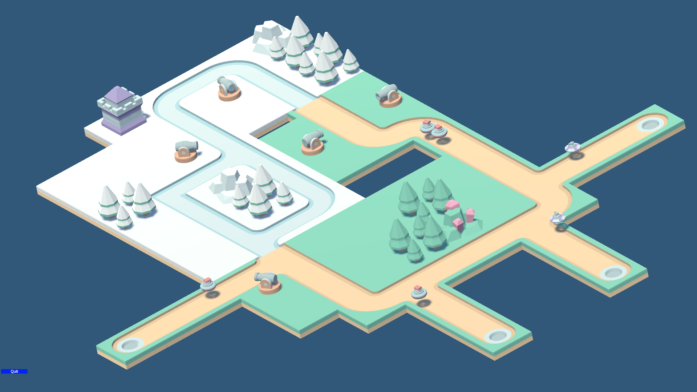

# Turrets Defending Against Randomly Spawning Enemies: Unity AI Pathfinding

## Key Components

### 1. **Enemy Spawning**
- **Random Spawn Points**: Predefined spawn points placed around the map. Enemies spawn randomly at these locations.
- **Spawn Manager**: A script to control enemy spawning with intervals or wave systems.

### 2. **AI Pathfinding**
- **Unity NavMesh**: Enemies use the NavMesh Agent to navigate from spawn points to a target (e.g., the player base).
- **Dynamic Pathfinding**: The NavMesh Agent recalculates paths if obstacles (like new turrets) are introduced.

### 3. **Defensive Turrets**
- **Detection Mechanism**: A trigger collider detects enemies within range of the turret.
- **Target Selection**: The turret prioritizes the closest or weakest enemy within its range.
- **Projectile Firing**: Turrets shoot projectiles that follow detected enemies and deal damage on impact.

---

The image shows turrets strategically placed to intercept enemies navigating towards a target. Enemies spawn randomly and use Unity's NavMesh to find the shortest path while turrets actively defend the target.
